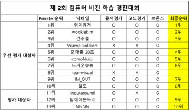
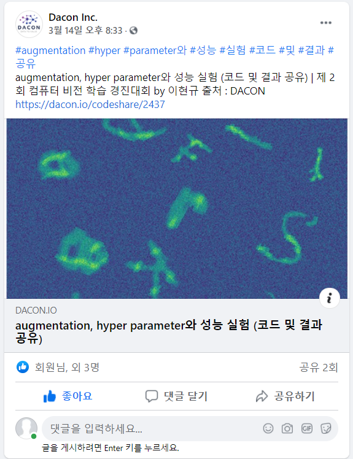

# 제 2회 컴퓨터 비전 학습 경진대회 참여

### Tag
월간 데이콘 12 | 컴퓨터 비젼 | multi-label classification | 도커 제출

___

## 🥇 성과

### 최종 순위 9위 달성
 ([link](https://dacon.io/competitions/official/235697/talkboard/402704?page=1&dtype=recent))  


### Dacon 공식 Facebook에서 Code 공유
 ([link](https://www.facebook.com/dacon.io/))  

___

## 대회 개요

### 대회 설명
(256, 256)크기의 이미지 속에 10 ~ 14개의 글자(알파벳 a – Z, 중복 제외)가 무작위로 배치되어 있습니다. 이번 대회의 문제는 이러한 이미지 속에 들어있는 알파벳과 들어있지 않은 알파벳을 분류하는 multi-label classification입니다.	([link](https://dacon.io/competitions/official/235697/overview/description#desc-info))  


### 대회 배경
컴퓨터 비전은 가장 빠르게 발전하는 인공 지능 분야 중 하나로 학계, 산업계에서 많은 연구가 이루어지고 있습니다. 손글씨 이미지인 MNIST 데이터 세트는 이 분야의 고전적인 문제로 잘 알려져 있는데요, 이번 월간 데이콘 12는 월간 데이콘 7의 후속작으로 무작위로 합성된 10 ~ 15개의 글자를 분류하는 multi-label classification대회입니다. 월간 데이콘 12에서 컴퓨터 비전 실력을 업그레이드해보세요! ([link](https://dacon.io/competitions/official/235697/overview/description#desc-info))  

___

## 📆 대회 참여 개요

### 팀 소개  
팀 닉네임 : 함께하는우리  
팀원 : Boostcamp Peers (박재우, 박창협)  
개발 환경 : Python, Colab


### 참여 일정
|일시|내용|비고|  
|:--:|:--:|:--:|
|21.02.01 ~ 10|참가 신청 및 팀 병합||
|21.02.11 ~ 14|Backbone Model 탐색|팀원 별 관심 Model 선택|
|21.02.15 ~ 18|RepVGG Traning and Submit|Public Score 0.843 달성|
|21.02.19 ~ 20|Baseline 재구성|다양한 실험 등을 위해 개인 Code 작성|
|21.02.21 ~ 22|Backbone Model 재탐색|Backbone Model을 EfficientNet으로 결정|
|21.02.22 ~ 23|성능 개선 실험|Augmentation and Hyper-params에 따른 성능 변화 실험|
|21.02.24 ~ 27|EfficientNet Training and Submit|Public Score 0.855 달성|
|21.02.28 ~ 03.01|Team Prediction Esemble|Public Score 0.867 달성|
|21.03.02 ~ 08|Docker 구성 및 Code 제출|Private Score 0.869 및 최종 순위 달성|

___

## 💡 문제 상황 및 극복 방안

### Backbone Model 탐색  
Backbone Model을 탐색하는데 많은 시간을 소요했다.  
우리 팀은 각자 관심 Model을 선정하고 성능을 테스트해보기로 했다.  
나는 마침 당시에 VGG 논문을 읽고 있었고, `RepVGG`의 자극적인 제목에 관심이 쏠렸다.  
(논문의 제목은 `RepVGG: Making VGG-style ConvNets Great Again`이다.)  
실제로 RepVGG를 준수한 Score를 얻긴 했으나, 그 이상의 진전은 어렵다고 판단 됐다.  팀원이 선택했던 Model에서도 더 좋은 Score를 거두지 못했고, Backbone Model 재탐색의 시간을 가졌다.

Papers-with-code 사이트 ([Link](https://paperswithcode.com/sota/image-classification-on-imagenet)) 덕분에 Model의 객관적인 성능을 파악할 수 있었고, 우리 팀은 SOTA Model인 EfficientNet을 Backbone Model로 결정했다.  (실제로 상위권에 있는 모든 팀은 EfficientNet을 사용했다. ([Link](https://dacon.io/competitions/official/235697/codeshare/)))


### Baseline Code의 한계  
Baseline Code는 문제를 해결하거나, 다양한 실험을 하기에 적합하지 않았다.  
이에, Baseline을 토대로 개인 Code를 작성했다. ([Code](./EfficientNet_silu.ipynb))  
특히, Colab 환경에서 처할 수 있는 다양한 이슈에 대처할수 있도록 Code를 구성했다.  


### 성능 향상의 문제
Model의 성능을 향상을 위해 Augmentation과 Hyper-parameter에 대한 실험을 수행했다.    
실험의 당위성과 속도 향상을 위해 Label을 고려한 2,000장의 Image로 실험을 설계했다.  
실험의 결과를 지속적으로 확인하기 위해 Log를 남기도록 Code를 구성했다. ([Code](./Training_Options_Experiment.ipynb))  
각 설정에 따른 성능 정보는 `Training_Options_Experiment_Logs` 디렉토리 아래의 Log File이나, Code의 결과 Cell을 통해 확인할 수 있다. ([Directory](./Training_Options_Experiment_Logs))

```
# 2000개의 data와 전체 train data간의 정답 분포 확인
'''
약 1%내외의 차이를 보이며, 최대 2.1%까지 차이가 나는 것 확인
2000개의 샘플데이터로 하는 테스트가 유의미하리라 판단
'''

y_train.mean(axis=0) - y_train[:2000].mean(axis=0)


# 각 실험의 설정을 log file에 기록
f = open('train_option.log', 'a')
f.write('-----Transforms-----\n')
f.write(f'train_transform : {train_transform}\n')
f.write(f'valid_transform : {valid_transform}\n')
f.write('-----Train Option-----\n')
f.write(f'batch_size : {batch_size},\tlr : {lr},\tepochs : {epochs}\n')
f.write(f'lr_scheduler_step : {lr_scheduler_step},\tlr_scheduler_gamma : {lr_scheduler_gamma}\n\n')

# 실험용 학습
'''
위의 설정에 따라 학습이 진행되고, 각 epoch마다 값들이 log file에 저장됨.
'''
start_time = time.time()
for fold in range(1) :
...(후략)...
```

### Session 종료 등으로 인한 Issue  
Session이 종료 되더라도, 재학습이 가능하도록 Code를 구성할 필요가 있었다.  
매 Epoch마다 Validation Loss를 Check하고, Model State Dict를 저장하도록 Code를 구성했다.  
각 File은 몇 번의 Epoch를 수행했는지에 대한 정보를 저장해, 해당 시점부터 학습을 재개할 수 있도록 설계했다.  
또한, Google Drive의 Memory Issue를 피하기 위한 장치도 마련했다.  
```
# Train in fold
'''
체크포인트로부터 학습을 재개하는 경우 ##로 표시된 부분을 변경할 필요가 있습니다.
체크포인트를 로드 할 수 있도록 파일 명을 기재해야 합니다. (model directory 참고)
체크포인트의 val_loss값을 valid_loss_min으로 설정해야 합니다.
체크포인트의 epoch만큼 pass한 후 학습되도록 설정해야 합니다.

validation 수행 시 해당 epoch의 평균 loss가 계산되도록 설정해야 합니다.
valid_loss가 valid_loss_min보다 작은 경우 더 좋은 모델로 판단하고,
해당 폴드의 이전 모델을 0byte로 만들고 삭제한 후 모델의 state_dict를 저장합니다.
'''

for fold in now_train_folds :
    # Modeling
    model = MnistEfficientNet(in_channels=3).to(device)
    # model.load_state_dict(torch.load(''))  ## if started in checkpoint change this to best model of now fold (ex. 'model/4fold_24epoch_0.1989_silu.pth')
    optimizer = torch.optim.Adam(model.parameters(), lr=lr)
    lr_scheduler = torch.optim.lr_scheduler.StepLR(
        optimizer, step_size=lr_scheduler_step, gamma=lr_scheduler_gamma)
    criterion = torch.nn.BCELoss()

...(중략)...

        if valid_loss < valid_loss_min :
            valid_loss_min = valid_loss
            for f in glob.glob(os.path.join(model_path, str(fold)+'*_silu.pth')) :  # if you want to train another model, change this
                open(os.path.join(model_path, f), 'w').close()
                os.remove(os.path.join(model_path, f))
            torch.save(model.state_dict(), f'{model_path}/{fold}fold_{epoch}epoch_{valid_loss:2.4f}_silu.pth') # if you want to train another model, change this
```


### Data Set의 일관성 문제  
Session의 종료로 인한 학습 재개나, 각각의 Session이 Data Set을 일관적으로 사용하지 못한다고 판단했다.  
Random Seed를 고정하더라도, 매번 Fold Index를 구하는 것은 불안정한 Code라고 생각했다.

Fold Index를 File로 저장하는 아이디어를 통해 이를 해결했다. 이를 통해 Train Set과 Validation Set을 일관성 있게 사용할 수 있었다.  
```
# Load train and validation index
'''
재현 등의 이슈에 대처하기 위해, KFold로 분리된 index를 file로 관리합니다.
해당 파일이 없는 경우에는 KFold 수행 후 index를 가진 객체를 file로 저장하며,
해당 파일이 있는 경우에는 List[Tuple[np.array, np.array]]형태로 파일을 로드합니다.
이 방법으로 세션이나 런타임의 종료 등의 이슈가 생기더라도 매번 동일한 데이터 사용을 보장합니다.
'''

if os.path.isfile('Train_KFold.pkl') :
    with open('Train_KFold.pkl', 'rb') as f :
        folds = pickle.load(f)
else : 
    kf = KFold(n_splits=5, shuffle=True, random_state=seed)
    folds = []
    for train_idx, valid_idx in kf.split(imgs) :
        folds.append((train_idx, valid_idx))
    with open('Train_KFold.pkl', 'wb') as f :
        pickle.dump(folds, f)
```


### Data Load간 시간 소요의 문제  
Colab 환경에서 50,000장의 Image를 `cv2.load`로 Load 하는데 매우 많은 시간이 소요되었다.  
각 Session에서 매번 이 과정을 거치기 때문에, 이에 대한 부분을 개선할 필요가 있었다.

NumPy File로 저장하는 아이디어를 통해 이 문제를 해결했다.  
이를 통해, 기존에 약 50분 걸리던 과정을 최장 3분 이내로 단축시켰다.  
```
# Load Images
'''
구글 드라이브에서 Load 하는데 시간이 오래 걸리는 관계로, Image data를 하나의 .npy file로 관리합니다.
해당 파일이 없는 경우에는 모든 데이터를 로드한 후 file로 저장하며,
해당 파일이 있는 경우에는 np.array 객체를 로드합니다.
이 방법으로 평균 2~3분 남짓한 시간으로 이미지 파일을 로드할 수 있는 장점이 있습니다.
단, file이 9GB이며 로드 시 메모리를 약 15GB 이상 사용합니다.
'''

if os.path.isfile('Imgs_Numpy.npy') :
    st = time.time()
    imgs = np.load('Imgs_Numpy.npy')
    print(imgs.shape)
    print(int(time.time()-st),'sec')
else :
    imgs = []
    for img_file in tqdm(imgs_path) :
        img = cv2.imread(img_file, cv2.IMREAD_COLOR)
        imgs.append(img)
    imgs = np.array(imgs)
    np.save('Imgs_Numpy.npy', imgs)
```


### Cuda Out of Memory Issue  
실험 결과 적합한 Augmentation을 찾았으나, Resize 시 Memory 이슈가 발생했다.  
Resize가 큰 폭으로 성능을 향상시키는 것을 확인했기 때문에, Batch Size를 작게 설정하여 학습을 진행했다.
```
# Set augmentation and transform
'''
실험을 통해 좋은 성과를 낸다고 판단된 augmentation을 train_set에 적용했습니다.
모델의 학습 환경에서 augmentation은 제외하고, transform만 동일하게 valid_set에 적용합니다.
'''

train_transform = T.Compose([
    T.ToPILImage(),
    T.Resize((331,331)),
    T.RandomHorizontalFlip(p=0.6),
    T.RandomVerticalFlip(p=0.6),
    T.RandomRotation(40),
    T.ToTensor(),
    T.Normalize(mean=(0.485, 0.456, 0.406), std=(0.229, 0.224, 0.225))
])

valid_transform = T.Compose([
    T.ToPILImage(),
    T.Resize((331,331)),
    T.ToTensor(),
    T.Normalize(mean=(0.485, 0.456, 0.406), std=(0.229, 0.224, 0.225))
])

# Set hyper parameters
'''
모델의 크기와 resize와 같은 이유로 작은 batch size를 사용했습니다.
세션의 종료 등의 이슈로 체크포인트로부터 학습을 재개하는 경우 lr의 값을 변경할 필요가 있습니다.
'''

batch_size = 8
lr = 0.001  ## if started in checkpoint change this (ex. lr = 0.001 * (0.75 ** 5))
epochs = 25
lr_scheduler_step = 5
lr_scheduler_gamma = 0.75
```

___


## 🏃 한계점 및 개선사항
1. Test Time Augmentation 기법에 대한 실험을 하지 못했다.
2. Loss Function과 Acivation Function에 대한 탐색이 부족했다.
3. Augmentation 외에 Image에 대한 직접적인 전처리가 없었다.
4. Backbone Model 탐색에 시간 소요가 길었다.
5. Batch Size에 따른 성능 변화를 간과했다.
